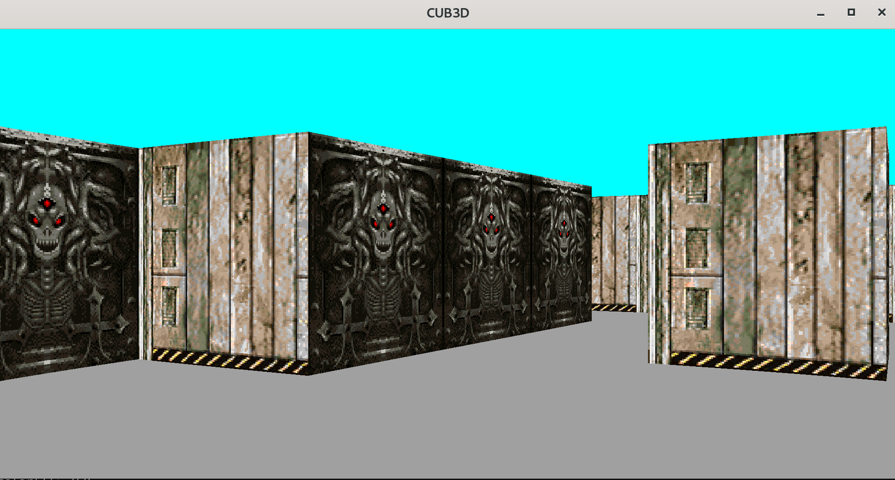

<h1 align="center">School 42 cub3D</h1>



Collaborators: 

This repository contains my implementation of the cub3D project from the 42 cursus. The goal is to create a 3D maze from a first-person perspective using the Ray-casting technique, inspired by the iconic game Wolfenstein 3D.

<h2 align="center">
    <a href="#about">About</a>
    <span> · </span>
    <a href="#structure">Structure</a>
    <span> · </span>
<a href="#bonus-features">Bonus Features</a>
    <span> · </span>
    <a href="#requirements">Requirements</a>
    <span> · </span>
    <a href="#instructions">Instructions</a>
</h2>

## About

cub3D is a graphical project that dives into the fundamentals of 3D representation using a 2D map. The objective is to parse a scene description file (.cub) and render a dynamic 3D view of a maze. The player can navigate this maze, experiencing a pseudo-3D world built with the MLX42 graphics library.

The core of the project is to implement a ray-casting engine from scratch to create the illusion of depth and perspective.

You can find more details in the official project subject: 

## Structure

1. Map Parsing and Validation

* The program takes a .cub file as an argument, which contains all the necessary information about the scene.

* Scene Elements: The parser reads and validates textures for the North, South, East, and West walls, as well as the RGB color codes for the floor and ceiling.

* Map Validation: The map itself is thoroughly checked to ensure it is valid. This includes verifying that it is completely enclosed by walls ('1') to prevent the player from escaping the defined area.

2. Ray-casting Engine

* The 3D effect is achieved by casting rays from the player's position across their field of view (FOV).

* For each vertical stripe of the screen, a ray is cast. The engine calculates the distance from the player to the first wall it hits.

* Based on this distance, the height of the wall stripe to be drawn on the screen is determined: closer walls appear taller, and farther walls appear shorter. This creates the illusion of perspective.

* The engine also determines which texture to apply based on whether the ray hit a wall facing North, South, East, or West.

3. Player Controls and Rendering

* The game is rendered in real-time using the MLX42 library.

* Movement: The player can move forward and backward (W, S) and strafe left and right (A, D).

* Rotation: The player can look left and right using the arrow keys.

* The game window can be closed cleanly by pressing the ESC key or clicking the window's close button.

## Bonus Features

This version of cub3D includes several bonus features that enhance the gameplay and technical complexity:

* Wall Collisions: The player cannot walk through walls.

* Minimap: A 2D minimap is displayed on the screen, showing the player's position and the layout of the maze.

* Doors: The map can include doors ('D') that can be opened and closed by the player, pressing `space`.

* Mouse Control: The player can rotate their point of view by moving the mouse left and right.

Note: The animated sprites bonus has not been implemented in this version.

## Requirements

To compile and run this project, you will need:

* A C compiler, such as gcc.

* The make utility.

* The MLX42 library (included in the repository) and its dependencies (-ldl -lglfw -pthread -lm).

## Instructions

1. Compile the Project

To compile the mandatory cub3D program:
```$ make```

To compile the cub3D_bonus program:
```$ make bonus```

The Makefile will automatically build the included libft and MLX42 libraries.

2. Clean Files

To remove the object files (.o):
```$ make clean```

To remove object files and the executables:
```$ make fclean```

To clean and recompile everything:
```$ make re```

3. How to Run

Run the game with a map file as an argument. Several valid maps are included in the maps/ and maps_bonus/ directories.

Example: 
```$ ./cub3D_bonus maps_bonus/valid/valid_map.cub```


